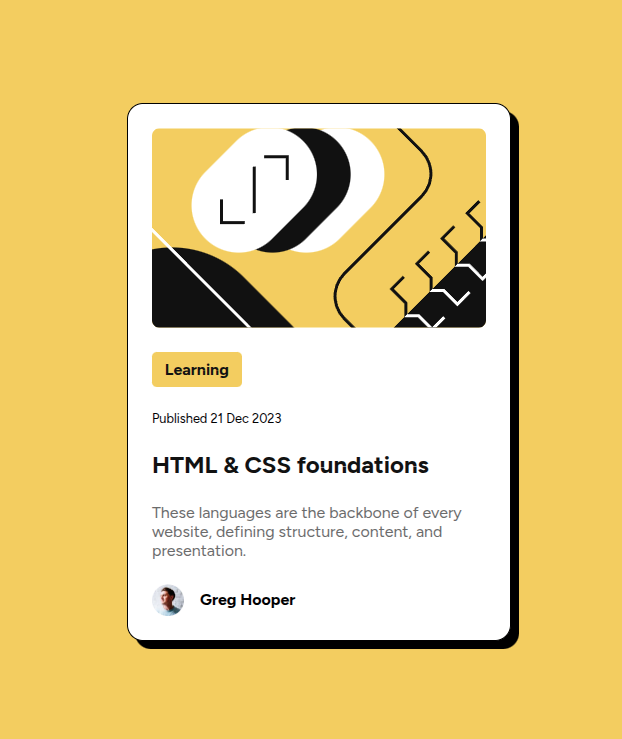

# Blog Preview Card

This is my second project in my Front-end journey! Feel free to give me a star 😄
 
It features a responsive article blog card by using only HTML and CSS.
 
I was able to use a custom font using **font-face** for the first time, also my first time using box shadow.

---

## 📸 Preview

---

## How to use and customize

1. Clone the repo

`git clone https://github.com/rodrigodvalente/blog-preview-card.git`

2. Navigate to the directory

`cd blog-preview-card`

3. Open the `index.html` and customize in your code editor of preference

---

## 🧠 Best practices

It features **variables**, **:hover**, **font-face**, **box-shadow**, **BEM**, **responsive function** (as media queries wasn't needed) - min(380px, 80%)

I also used Prettier to make the layout better on **VSCode** and used the command line for versioning with Git.